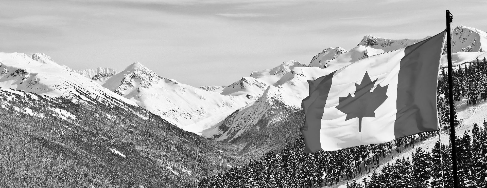

# Image Optimization Guide

## Next Steps for Image Optimization

To further improve the Largest Contentful Paint (LCP) and overall performance, you should optimize the images in the `img/` folder.

### Images that Need Optimization

1. **hero.jpeg** (Hero background image)
2. **cta-bg.jpg** (CTA section background)
3. **ProudMouth_WorkMark_Horizontal-sm.png** (Logo)

## Recommended Optimization Process

### 1. Convert to WebP Format

WebP provides 25-35% better compression than JPEG/PNG while maintaining quality.

**Using Online Tools:**
- [Squoosh](https://squoosh.app/) - Google's image compression tool
- [CloudConvert](https://cloudconvert.com/jpg-to-webp)

**Using Command Line (ImageMagick):**
```bash
# Install ImageMagick (if not already installed)
# macOS: brew install imagemagick
# Ubuntu: sudo apt-get install imagemagick

# Convert images to WebP
convert img/hero.jpeg -quality 85 img/hero.webp
convert img/cta-bg.jpg -quality 85 img/cta-bg.webp
```

**Using Node.js (sharp library):**
```bash
npm install sharp
```

Create a file called `optimize-images.js`:
```javascript
const sharp = require('sharp');
const fs = require('fs');

async function optimizeImages() {
  // Optimize hero.jpeg
  await sharp('img/hero.jpeg')
    .webp({ quality: 85 })
    .toFile('img/hero.webp');

  // Create mobile version (480px wide)
  await sharp('img/hero.jpeg')
    .resize(480)
    .webp({ quality: 80 })
    .toFile('img/hero-mobile.webp');

  // Create desktop version (1920px wide)
  await sharp('img/hero.jpeg')
    .resize(1920)
    .webp({ quality: 85 })
    .toFile('img/hero-desktop.webp');

  // Optimize CTA background
  await sharp('img/cta-bg.jpg')
    .webp({ quality: 85 })
    .toFile('img/cta-bg.webp');

  console.log('Images optimized successfully!');
}

optimizeImages();
```

Run: `node optimize-images.js`

### 2. Update HTML After Converting Images

Once you have the WebP versions, update the HTML:

#### For Hero Background (index.html line ~121):
Replace:
```html
<section
  id="home"
  class="relative bg-white bg-cover bg-center"
  style="background-image: url('img/hero.jpeg')"
>
```

With:
```html
<section
  id="home"
  class="relative bg-white bg-cover bg-center"
  style="background-image: image-set(
    url('img/hero.webp') type('image/webp'),
    url('img/hero.jpeg') type('image/jpeg')
  )"
>
```

Or better yet, use a `<picture>` element if you want to add responsive images:
```html
<section id="home" class="relative bg-white">
  <picture>
    <source
      media="(max-width: 640px)"
      srcset="img/hero-mobile.webp"
      type="image/webp"
    />
    <source
      media="(max-width: 640px)"
      srcset="img/hero-mobile.jpeg"
      type="image/jpeg"
    />
    <source
      srcset="img/hero-desktop.webp"
      type="image/webp"
    />
    
  </picture>
  <!-- Rest of hero content -->
</section>
```

#### For CTA Background (index.html line ~799):
Replace:
```html
<div
  class="absolute inset-0 bg-cover bg-center grayscale"
  style="background-image: url('img/cta-bg.jpg')"
></div>
```

With:
```html
<div
  class="absolute inset-0 bg-cover bg-center grayscale"
  style="background-image: image-set(
    url('img/cta-bg.webp') type('image/webp'),
    url('img/cta-bg.jpg') type('image/jpeg')
  )"
></div>
```

### 3. Optimize PNG Logo

For the logo, you can:
1. Convert to SVG (vector format, best for logos) - ask your designer
2. Keep as optimized PNG
3. Convert to WebP with transparency

```bash
# Using sharp for PNG optimization
npm install sharp

# Create optimize-logo.js:
const sharp = require('sharp');

sharp('img/ProudMouth_WorkMark_Horizontal-sm.png')
  .webp({ quality: 95, lossless: true })
  .toFile('img/ProudMouth_WorkMark_Horizontal-sm.webp');
```

Then update HTML to use WebP with PNG fallback:
```html
<picture>
  <source srcset="img/ProudMouth_WorkMark_Horizontal-sm.webp" type="image/webp">
  
</picture>
```

## Expected Results

After optimizing images:
- **File size reduction**: 30-50% smaller
- **LCP improvement**: From ~6.3s to < 2.5s
- **Performance score**: Should reach 90+ on Lighthouse

## Quick Reference: Image Sizes

Based on the current layout:
- **hero.jpeg**: Recommended max width 1920px
- **hero-mobile.jpeg**: Recommended width 480-640px
- **cta-bg.jpg**: Recommended max width 1920px
- **Logo PNG**: Current size is fine (small already)

## Verification

After implementing, test with:
1. Lighthouse (Chrome DevTools)
2. [PageSpeed Insights](https://pagespeed.web.dev/)
3. [WebPageTest](https://www.webpagetest.org/)

Target scores:
- Performance: 90+
- Accessibility: 95+
- Best Practices: 90+
- SEO: 90+
